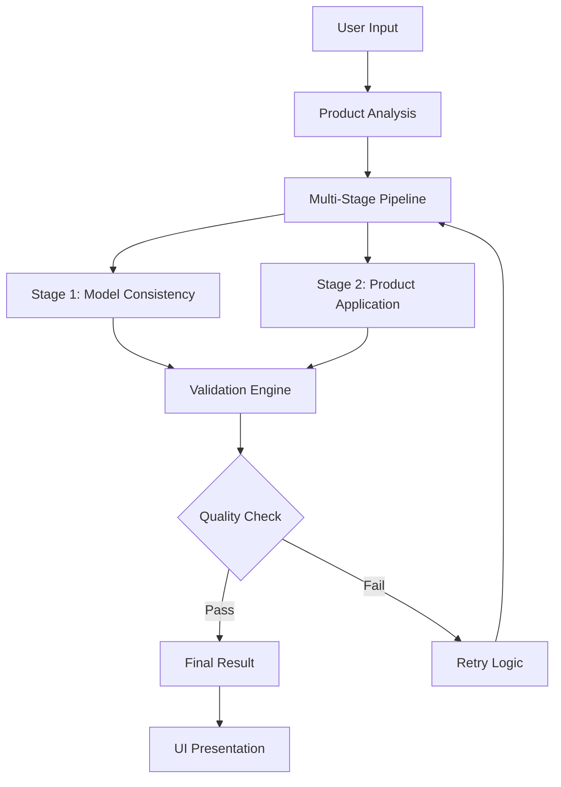

# Design Document

## Overview

The Enhanced Try-On Consistency system addresses the core challenge of maintaining both model consistency and product accuracy in AI-generated try-on images. The current implementation suffers from a fundamental trade-off where optimizing for model consistency reduces product accuracy and vice versa. This design introduces a multi-stage generation pipeline, enhanced validation systems, and improved UI/UX to achieve both objectives simultaneously.

## Architecture

### Current System Analysis

The existing system uses a single-pass generation approach:
1. **Single API Call**: Either OpenAI GPT Image 1 or FLUX Pro 1.1
2. **Reference Image**: Model reference image as primary input
3. **Product Integration**: Product image as secondary context
4. **Prompt Engineering**: Text-based instructions for changes

**Current Limitations:**
- Single-pass generation cannot optimize for both model and product simultaneously
- Limited control over which aspects get priority during generation
- No validation of output quality before presenting to user
- UI lacks detailed feedback and control mechanisms

### Enhanced Architecture



## Components and Interfaces

### 1. Enhanced Image Generation Pipeline

#### Multi-Stage Generation Service
```javascript
class EnhancedGenerationService {
  async generateWithConsistency(options) {
    // Stage 1: Perfect model + pose
    const stage1Result = await this.generateModelConsistency(options);
    
    // Stage 2: Apply product accurately
    const stage2Result = await this.applyProductDetails(stage1Result, options);
    
    // Validation
    const validationResult = await this.validateResult(stage2Result, options);
    
    if (!validationResult.passes) {
      return this.retryWithAdjustments(options, validationResult.feedback);
    }
    
    return stage2Result;
  }
}
```

#### Product Analysis Enhancement
```javascript
class ProductAnalysisService {
  async analyzeProduct(imagePath) {
    // Enhanced GPT-4o analysis with structured output
    const structuredAnalysis = await this.getStructuredAnalysis(imagePath);
    
    // Logo/branding detection
    const brandingDetails = await this.detectBranding(imagePath);
    
    // Color extraction and matching
    const colorProfile = await this.extractColorProfile(imagePath);
    
    return {
      structured: structuredAnalysis,
      branding: brandingDetails,
      colors: colorProfile,
      confidence: this.calculateConfidence()
    };
  }
}
```

### 2. Quality Validation Engine

#### Consistency Validator
```javascript
class ConsistencyValidator {
  async validateModelConsistency(generatedImage, referenceModel) {
    // Face similarity analysis
    const faceScore = await this.compareFaces(generatedImage, referenceModel.referenceImage);
    
    // Body pose validation
    const poseScore = await this.validatePose(generatedImage, expectedPose);
    
    return {
      faceConsistency: faceScore,
      poseAccuracy: poseScore,
      overallScore: (faceScore + poseScore) / 2
    };
  }
  
  async validateProductAccuracy(generatedImage, productReference) {
    // Color matching
    const colorScore = await this.compareColors(generatedImage, productReference);
    
    // Style/pattern matching
    const styleScore = await this.compareStyles(generatedImage, productReference);
    
    // Logo/branding validation
    const brandingScore = await this.validateBranding(generatedImage, productReference);
    
    return {
      colorAccuracy: colorScore,
      styleAccuracy: styleScore,
      brandingAccuracy: brandingScore,
      overallScore: (colorScore + styleScore + brandingScore) / 3
    };
  }
}
```

### 3. Retry and Optimization Logic

#### Adaptive Retry System
```javascript
class AdaptiveRetryService {
  async retryWithAdjustments(originalOptions, validationFeedback) {
    const adjustedOptions = this.adjustParameters(originalOptions, validationFeedback);
    
    // Try different approaches based on what failed
    if (validationFeedback.modelConsistency < 0.7) {
      return this.retryWithStrongerModelFocus(adjustedOptions);
    }
    
    if (validationFeedback.productAccuracy < 0.7) {
      return this.retryWithStrongerProductFocus(adjustedOptions);
    }
    
    return this.retryWithBalancedApproach(adjustedOptions);
  }
}
```

### 4. Enhanced UI Components

#### Generation Control Panel
```javascript
const EnhancedGenerationPanel = () => {
  return (
    <div className="generation-panel">
      <ProductUploadSection />
      <ModelSelectionSection />
      <QualityControlSection />
      <AdvancedOptionsSection />
      <GenerationProgressSection />
    </div>
  );
};
```

#### Real-time Validation Display
```javascript
const ValidationDisplay = ({ validationResults }) => {
  return (
    <div className="validation-display">
      <ConsistencyMeter score={validationResults.modelConsistency} />
      <AccuracyMeter score={validationResults.productAccuracy} />
      <QualityBreakdown details={validationResults.breakdown} />
    </div>
  );
};
```

## Data Models

### Enhanced Generation Request
```javascript
interface EnhancedGenerationRequest {
  // Core requirements
  modelId: string;
  productImage: File;
  pose: string;
  
  // Quality settings
  qualityTier: 'standard' | 'premium' | 'ultra';
  consistencyPriority: number; // 0-1 scale
  accuracyPriority: number; // 0-1 scale
  
  // Advanced options
  retryLimit: number;
  validationThreshold: number;
  fallbackStrategy: 'model-first' | 'product-first' | 'balanced';
  
  // Product analysis
  productAnalysis?: ProductAnalysis;
  brandingRequirements?: BrandingRequirements;
}
```

### Validation Results
```javascript
interface ValidationResults {
  modelConsistency: {
    faceScore: number;
    poseScore: number;
    overallScore: number;
  };
  
  productAccuracy: {
    colorScore: number;
    styleScore: number;
    brandingScore: number;
    overallScore: number;
  };
  
  overallQuality: number;
  passes: boolean;
  feedback: string[];
  recommendations: string[];
}
```

### Generation History
```javascript
interface GenerationHistory {
  id: string;
  timestamp: Date;
  request: EnhancedGenerationRequest;
  results: ValidationResults;
  attempts: GenerationAttempt[];
  finalImage: string;
  cost: number;
  processingTime: number;
}
```

## Error Handling

### Graceful Degradation Strategy
1. **Primary Approach**: Multi-stage FLUX generation with validation
2. **Fallback 1**: Single-stage FLUX with enhanced prompting
3. **Fallback 2**: OpenAI GPT Image 1 with reference editing
4. **Fallback 3**: Basic generation with user notification

### Error Recovery Patterns
```javascript
class ErrorRecoveryService {
  async handleGenerationFailure(error, context) {
    switch (error.type) {
      case 'API_TIMEOUT':
        return this.retryWithDifferentProvider(context);
      
      case 'VALIDATION_FAILURE':
        return this.adjustParametersAndRetry(context);
      
      case 'QUOTA_EXCEEDED':
        return this.queueForLaterProcessing(context);
      
      default:
        return this.fallbackToBasicGeneration(context);
    }
  }
}
```

## Testing Strategy

### Automated Quality Testing
1. **Consistency Tests**: Automated face similarity scoring
2. **Accuracy Tests**: Color and style matching validation
3. **Performance Tests**: Generation time and cost optimization
4. **Regression Tests**: Ensure improvements don't break existing functionality

### A/B Testing Framework
```javascript
class ABTestingService {
  async runGenerationComparison(testConfig) {
    const controlResult = await this.generateWithCurrentSystem(testConfig);
    const treatmentResult = await this.generateWithEnhancedSystem(testConfig);
    
    return {
      control: await this.evaluateResult(controlResult),
      treatment: await this.evaluateResult(treatmentResult),
      winner: this.determineWinner(controlResult, treatmentResult)
    };
  }
}
```

### User Acceptance Testing
1. **Quality Scoring**: User ratings for generated images
2. **Workflow Testing**: UI/UX improvements validation
3. **Performance Metrics**: Time-to-result and user satisfaction

## Implementation Phases

### Phase 1: Core Pipeline Enhancement
- Multi-stage generation implementation
- Enhanced product analysis
- Basic validation engine

### Phase 2: Quality Validation System
- Consistency validation algorithms
- Retry logic implementation
- Performance optimization

### Phase 3: UI/UX Improvements
- Enhanced control panels
- Real-time feedback systems
- Quality visualization tools

### Phase 4: Advanced Features
- Machine learning optimization
- Predictive quality scoring
- Automated parameter tuning

## Performance Considerations

### Optimization Strategies
1. **Caching**: Product analysis results and model references
2. **Parallel Processing**: Multiple generation attempts simultaneously
3. **Smart Queuing**: Priority-based job scheduling
4. **Resource Management**: API quota optimization

### Monitoring and Metrics
```javascript
interface PerformanceMetrics {
  generationTime: number;
  validationTime: number;
  retryRate: number;
  successRate: number;
  userSatisfactionScore: number;
  costPerGeneration: number;
}
```

## Security and Privacy

### Data Protection
- Temporary file cleanup after processing
- Secure API key management
- User upload validation and sanitization

### Rate Limiting
- Per-user generation limits
- API quota management
- Abuse prevention mechanisms

This enhanced design provides a comprehensive solution to the consistency vs. accuracy challenge while maintaining system performance and user experience quality.